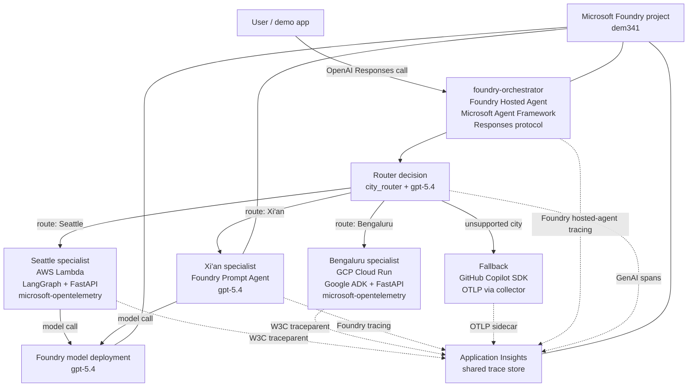
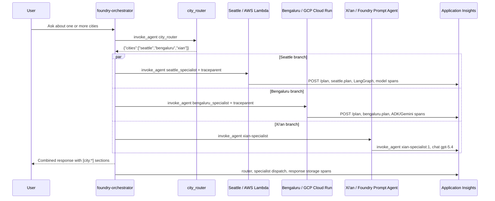

# Any Agent, Any Cloud — Architecture Diagram

## Trace shape to show on stage

## Key observability contract

- Every cross-agent boundary is represented as an `invoke_agent <agent>` span.
- W3C `traceparent` propagates from the orchestrator to AWS Lambda and GCP Cloud Run.
- Python services use the Microsoft OpenTelemetry distro to emit FastAPI, HTTP, model, and framework spans.
- All telemetry lands in the same Application Insights resource, which lets Foundry Observability show one distributed trace across clouds.
